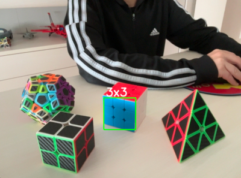

# How to train own haar cascade

This guide is useful to train own haar cascade for [cv2.CascadeClassifier](https://docs.opencv.org/4.9.0/db/d28/tutorial_cascade_classifier.html) of [OpenCV](https://opencv.org/).

***Pay Attention***: **createsamples** and **traincascade** are deprecated since OpenCV 4.0. Consider using these apps for training from 3.4 branch for Cascade Classifier. Model format is the same between 3.4 and 4.x.

It is part of the [educational repositories](https://github.com/pandle/materials) to learn how to use libraries.

## Install locally OpenCV 3.4

To install only the old applications **createsamples** and **traincascade**, it was difficult to find guidance.

The issues on OpenCV GitHub repository confirmed that it was enough to compile the applications and there was no need to use opencv 3.4 ([13231](https://github.com/opencv/opencv/issues/13231#issuecomment-1075683328), [14322](https://github.com/opencv/opencv/issues/14322), [16492](https://github.com/opencv/opencv/issues/16492)).

```sh
git clone https://github.com/opencv/opencv
cd opencv
git checkout origin/3.4
git switch -c 3.4
brew install cmake # for macOS or see Pay Attention text below
mkdir build
cd build
rm ../CMakeCache.txt
cmake .. -DCMAKE_BUILD_TYPE=Release -DCMAKE_INSTALL_PREFIX=../
make
ls bin/*create*
ls bin/*cascade*
cd ../../
```

If the ``ls`` commands return a file, you are completed the installation of the old applications.

***Pay Attention***: if you use Linux, you may have to change the command ``brew install cmake`` with the details that you can find in the paragraph named Required Packages on the [Tutorial to install on Linux](https://docs.opencv.org/3.4/d7/d9f/tutorial_linux_install.html). In addition, you can take advantage from [stackoverflow](https://stackoverflow.com/questions/52117968/trying-to-compile-opencv-traincascade-for-opencv-3-4-3).

## Prepare your data

You have to split your images in two different folders:

* images with the right objects in the folder named **positive_images**
* images with another objects in the folder named **negative_images**

There are a lot of guides about this step:

* the original [tutorial of traincascade](https://docs.opencv.org/3.4/dc/d88/tutorial_traincascade.html)
* a [great job](https://github.com/mrnugget/opencv-haar-classifier-training) but today it doesn't work
* a [wonderful job](https://pythonprogramming.net/haar-cascade-object-detection-python-opencv-tutorial/) where there is a fantastic explanation to prepare your data

Below is a small summary:

* it is preferable to have ~2000 positive images (another [guide](https://coding-robin.de/2013/07/22/train-your-own-opencv-haar-classifier.html) says 600)
* you want to have 2:1 ratio of positive:negative images
* you want 10-20 stages (like epoches), if you want to spend a little, but it is cumulative, so you can stop, try and if you want you can pick up right where you left off

You can use to different approches:

* to use images cropped at one object
* to use images where you say where object(s) are

In the second approch, you need to create a file named **info.dat** with the path of image, how many objects there are and coordinates of the rectangle(s) of the each object.

In the example below, a record of **info.dat** file: the image *cube.4.jpg* has one object which occupies the entire image, from point (0,0) to point (255,255). 

```sh
./positive_images/cube.4.jpg 1 0 0 255 255
```

## Run the cascade tools from build/bin to train your cascade

Below the summary of the commands of the [wonderful guide](https://pythonprogramming.net/haar-cascade-object-detection-python-opencv-tutorial/) revised for the images used.

The test has been run with 37 positive images and 16 negative images. The images are scaled to 80x80 pixels and with 50 stages **traincascade** takes about 5 minutes (on a laptop with 4 CPU and 8GB RAM).

```sh
git clone https://github.com/bilardi/how-to-train-cascade
cd how-to-train-cascade
find ./positive_images -iname "*.jpg" > positives.txt
find ./negative_images -iname "*.jpg" > negatives.txt
# create vector of positive images
../opencv/build/bin/opencv_createsamples -info info.dat -num 37 -w 80 -h 80 -vec samples.vec
# train the classifier with vector and negative images
../opencv/build/bin/opencv_traincascade -data classifier -vec samples.vec -bg negatives.txt \
   -numStages 50 -minHitRate 0.999 -maxFalseAlarmRate 0.5 -numPos 37 -numNeg 16 -w 80 -h 80 \
   -mode ALL -precalcValBufSize 1024 -precalcIdxBufSize 1024 -featureType LBP
# check the embedding created
cat classifier/cascade.xml
```

## Test your haar cascade

The python script implemented is useful to detect more cascade classifiers: you only have to create a file named ``cascades.json`` with the association between name of the object and relative ``cascade.xml`` as the example below.

```json
{
    "3x3": "classifier/cascade.xml"
}
```

The name of the object is the string that the python script will print over the rectangle detected.

Now, to test your cascade classifiers, you only have to run the command below.

```sh
python3 detector.py
```



## LICENSE

This package is released under the MIT license.  See [LICENSE](https://github.com/bilardi/how-to-train-cascade/blob/master/LICENSE) for details.
